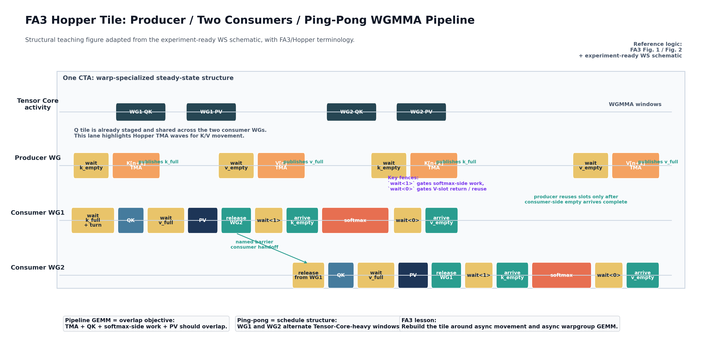
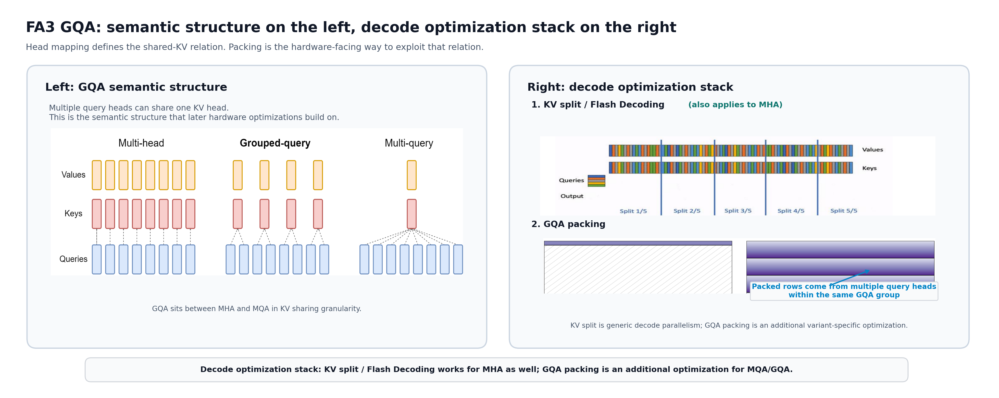

# FA3 on Hopper and Our GQA Kernel

从硬件原语、执行模型，到我们在 TileLang 中的实现

---

## 1. Why GQA Deserves Its Own Discussion

**核心观点**

`GQA` 不是简单的 “MHA 少几个 KV heads”，它首先改变了 workload structure。

**要点**

- 多个 `Q heads` 共享同一个 `KV head`
- 这会显著改变 `KV` footprint
- 也会改变后续 kernel 优化的重点

---

## 2. What Hopper Changes for Attention Kernels

**核心观点**

Hopper 改变的不是“峰值算力数字”，而是高性能 attention kernel 的设计空间。

**要点**

- `WGMMA`：Hopper 把 Tensor Core 主计算提升到 warpgroup 粒度。一个 warpgroup 由 `4 warps / 128 threads` 组成，协同 issue `wgmma.mma_async`，这比旧的 warp-level `mma.sync` 更适合大 tile 和深流水。
- `TMA`：Hopper 新增了专门的数据搬运硬件。单线程提交 tensor descriptor 和 block coordinates 之后，多维地址生成与 `GMEM <-> SMEM` 搬运由硬件完成，并通过 `mbarrier` / async barrier 通知完成。
- `WGMMA` 解决的是 compute roofline，`TMA` 解决的是 feed roofline。`TMA` 本身不会提高 HBM 峰值带宽，但会显著降低地址生成、copy loop 和线程占用开销，提高有效带宽利用率。
- 对我们关心的 dense `BF16/FP16` Tensor Core 路径，`H100/H200 SXM` 的理论峰值约为 `989 TFLOPS`；官方给出的带 sparsity 标称是 `1,979 TFLOPS`。`H200` 还提供 `4.8 TB/s` 的 `HBM3e` 带宽。
- 因此，attention kernel 的核心问题不再只是“算对”，而是能否让 `WGMMA` 持续有活干，并让 `TMA`、barrier 和寄存器分配不成为瓶颈。

---

## 3. What FA2 Already Got Right, and What It Left on the Table

**核心观点**

`FA2` 已经有正确的算法基础，但还不是围绕 Hopper async execution model 写的。

**要点**

- `FA2` 已经有 IO-aware FlashAttention formulation
- `FA2` 已经支持 `MQA/GQA`
- `FA2` 通过 indexing 避免复制 `K/V`
- 但 `FA2` 没有把 kernel 重写成 Hopper-native 的执行模型

---

## 4. FA3's Hopper-Specific Intra-Tile Redesign

**核心观点**

`FA3` 主要重写的是 tile 内执行模型：围绕 `WGMMA`、`TMA` 和 `ping-pong` pipeline 重新组织 kernel。



| 算法依赖逻辑 | 对应程序动作 |
| --- | --- |
| 当前拍 `QK` 之前，当前拍 `K tile` 必须已经到 shared memory | producer 先发 `TMA(K)` 并发布 `k_full`，consumer 在 `wait(k_full)` 之后才能 issue `WGMMA(QK)` |
| `PV` 除了依赖当前拍 score，还依赖对应的 `V tile ready` | 先等待 `v_full`，然后才能 issue 对应的 `WGMMA(PV)` |
| softmax-side work 不能直接跟在 `QK issue` 后面，必须等 `QK` accumulator 进入可消费状态 | 先过 `wait_group(1)`，再做 `acc_s` operand fence，之后才能进入 softmax / rescale 路径 |
| 另一组 consumer 只有在当前 consumer 发出本拍应负责的关键 GEMM 后，才能被 release | bootstrap (`n_idx == 0`) 时，release 跟在 `QK` 后；steady state (`n_idx > 0`) 时，release 跟在 `PV` 后。机制上对应 named barrier handoff |
| `K buffer` 在 `QK` 结果已经交给 softmax-side 路径后，就可以提前释放给 producer | 在 `wait_group(1)` + `acc_s` fence 之后 arrive `k_empty`，让 producer 能更早复用 K slot |
| `V buffer` 只有在 `PV` 真正完成后才能归还给 producer | 在 `wait_group(0)` + `acc_o` fence 之后 arrive `v_empty` |
| producer 的下一轮 `TMA` 不能抢先复用 buffer，必须等 consumer 明确归还 slot | 下一拍开始前，producer 先等待 `k_empty / v_empty`，然后才重发对应的 `TMA` |

| 结构角色 | 在 overlap 里的具体位置 |
| --- | --- |
| `TMA`：producer 负责把下一拍 `K/V` 从 `GMEM` 异步送到 `SMEM` | 对应 steady state 里最靠前的“喂数”波次：producer 在后台搬下一拍 `K/V`，不给 consumer 主计算抢执行资源 |
| `WGMMA(QK)`：当前拍 consumer 的第一段 Tensor Core 主计算 | 对应当前拍最核心的 compute wave：一旦 `k_full` 满足，当前 consumer 就开始 `QK` |
| softmax-side work：把 `QK` 结果接到标量路径 | 对应上一段 `QK` 进入 `wait<1> + acc_s fence` 后的消费窗口，它和另一侧的 `QK/PV` 交错进行 |
| `WGMMA(PV)`：consumer 的第二段 Tensor Core 主计算 | 对应与 softmax-side work 并行推进的另一条 compute wave；它还要额外等待 `v_full` |
| `ping-pong`：`1 producer + 2 consumers` 的接力结构 | 对应整个 steady state 的组织方式：一个 consumer 做当前拍 `QK`，另一个 consumer 处理上一拍相关的 softmax-side work / `PV` |

真正的 overlap 不是“所有步骤同时做”，而是 producer 喂数、当前拍 `QK`、上一拍 softmax/`PV` 这三类工作被 barrier 和 fence 精确错开。

**一个关键数字**

- `FA2` 在 `H100` 上大约只有 `35%` utilization
- `FA3` 的意义就在于把这部分 Hopper execution gap 补上

---

## 5. GQA Semantics and Decode Optimizations

**核心观点**

这一页其实在讲三层不同的东西：`GQA` 的 shared-KV 语义、decode 的通用并行化，以及建立在 `GQA` 结构上的额外 packing。



**按图来读**

- 左边：多个 `Q heads` 共享一个 `KV head`，这是 `GQA` 的定义，不是 schedule。
- 右边上半部分：先用 `KV split` 把 decode 工作沿 `KV/context` 方向切开，拿到足够并行度。
- 右边下半部分：再在 `MQA/GQA` 上用 `packing multiple query heads per KV head` 提高短 `Q` 下的 tile 利用率。

**结论**

- `head mapping` / shared-KV 是语义前提
- `KV split` 解决的是 decode 并行度问题
- `GQA packing` 解决的是短 `Q` 下 tile 利用率问题

---

## 6. How We Realize FA3 in TileLang

**核心观点**

这页真正要回答的不是“schedule 能不能对齐”，而是：`FA3/Hopper` 依赖的关键原语，在 `TileLang` 里有没有明确对应。

| FA3 / Hopper 关键原语 | 在 FA3 里负责什么 | TileLang 中怎么表达 |
| --- | --- | --- |
| `TMA` | 把 `K/V` 异步送到 `SMEM`，并把搬运从 consumer 计算路径中拿出去 | `T.tma_copy(...)` |
| full / empty barrier | 管理 `K/V` slot 何时 ready、何时可复用 | `T.barrier_wait(...)` / `T.barrier_arrive(...)` |
| `WGMMA` | 执行 `QK` 和 `PV` 两段 warpgroup Tensor Core 主计算 | `T.wgmma_gemm(...)` |
| `wait_group` | 把 async `WGMMA` 推进到 softmax-side / output-side 可消费边界 | `T.wait_wgmma(1)` / `T.wait_wgmma(0)` |
| operand fence | 把 `acc_s / acc_o` 从 Tensor Core accumulator 转成后续路径可安全读取的 operand | `T.warpgroup_fence_operand(...)` |
| named barrier handoff | 让 `WG1 / WG2` 在 steady state 中交替接力 | `T.sync_threads(barrier_id=..., arrive_count=256)` + `T.call_extern(... "tl::barrier_arrive_named", ...)` |

**结论**

`TileLang` 的关键价值，不只是“能写出相似 schedule”，而是这些 `FA3/Hopper` 原语大多都有明确映射；少数像 named barrier 这样的特殊机制，也可以通过更低层接口接进去。

---

## 7. Code Skeleton: Registers, TMA, WGMMA, and Fences

**核心观点**

代码骨架已经把 `FA3/Hopper` 的关键结构写出来了：寄存器再分配、`TMA`、`WGMMA`、barrier handoff、`wait/fence`。

```python
tx = T.get_thread_binding()

if tx < 128:
    # Producer WG
    T.dec_max_nreg(24)
    for n_idx in T.Pipelined(loop_range, num_stages=0):
        T.barrier_wait(k_empty, (n_idx + 1) % 2)   # 等 K buffer 可复用
        T.tma_copy(..., barrier=k_full)            # 发起 K 的 TMA
        T.barrier_arrive(k_full)                   # 发布 K ready

        if n_idx > 0:
            T.barrier_wait(v_empty, n_idx % 2)     # 等 V buffer 可复用
            T.tma_copy(..., barrier=v_full)        # 发起 V 的 TMA
            T.barrier_arrive(v_full)               # 发布 V ready

elif tx < 256:
    # Consumer WG1
    T.inc_max_nreg(240)
    T.call_extern("handle", "tl::barrier_arrive_named", 1, 256)

    for n_idx in T.Pipelined(loop_range, num_stages=0):
        T.barrier_wait(k_full, n_idx % 2)          # 等 K tile ready
        T.sync_threads(barrier_id=1, arrive_count=256)

        T.wgmma_gemm(...)                          # QK

        if n_idx > 0:
            T.barrier_wait(v_full, (n_idx - 1) % 2)
            T.wgmma_gemm(...)                      # PV

        T.call_extern("handle", "tl::barrier_arrive_named", 2, 256)
        T.wait_wgmma(1)                            # QK 可进入 softmax-side
        T.warpgroup_fence_operand(acc_s_1, num_regs=64)
        T.barrier_arrive(k_empty)                  # K buffer 可回收
        softmax_1(...)
        T.wait_wgmma(0)                            # PV 完成
        T.warpgroup_fence_operand(acc_o_1, num_regs=64)
        T.barrier_arrive(v_empty)                  # V buffer 可回收

else:
    # Consumer WG2
    # 与 WG1 对称，形成 1 producer + 2 consumers 的 ping-pong
    ...
```

**这段代码对应的结构**

- producer 和 consumer 的寄存器预算不一样
- `TMA` 和 `WGMMA` 是显式的
- `wait/fence` 不是装饰，而是 async pipeline 的边界
- 真实结构始终是 `1 producer + 2 consumers`
- 这里代码只详细展开了 `producer + WG1`，`WG2` 是与 `WG1` 对称的第二个 consumer

完整注释版素材见：
- [slide8_code_skeleton.md](assets/slide8_code_skeleton.md)

---

## 8. Takeaways

**最重要的结论**

这部分最重要的不是某个孤立 trick，而是一整套对齐关系：workload structure、decode policy 和 Hopper execution model 必须一起对齐。

**请记住这四点**

1. `GQA` 先改变 workload structure：shared-KV semantics
2. `FA3` 再重写 Hopper 上的执行模型：`TMA + WGMMA + ping-pong`
3. decode 上有两层优化：通用的 `KV split`，以及 `MQA/GQA` 上附加的 `GQA packing`
4. `TileLang` 能把这整套结构显式写出来，这也是后续 locality、register-flow 和 scheduling 优化的基础

---

## 9. Transition to Our Optimizations

到这里，应该已经能分清三件事：

- 哪些是语义
- 哪些是 decode policy
- 哪些是 Hopper execution machinery

这也是后面继续讲我们自己的优化工作时，不会丢主线的原因。

---

## References

**Figure references**

- Slide 5 figure (`slide5_fa3_hopper_intra_tile.png`)
  - 基于我们自己的 Hopper WS kernel 实现与时间线整理绘制
  - 对应代码骨架见 [\_test_ws_fa3_v2_threadbind_opt.py](/home/ga/TileOPs/_test_ws_fa3_v2_threadbind_opt.py)
- Slide 6 left panel
  - Ainslie et al., *GQA: Training Generalized Multi-Query Transformer Models from Multi-Head Checkpoints*, Figure 2
  - Paper: https://arxiv.org/abs/2305.13245
- Slide 6 right panel, upper half (`KV split / Flash Decoding`)
  - Tri Dao, *FlashAttention-3* GTC slides, p.17
  - Slides: /home/ga/TileOPs/experiments/ws_kernel_evolution/notes/fa3_gqa_hopper_talk/assets/external/gtc/fa3_gtc.pdf
- Slide 6 right panel, lower half (`GQA packing`)
  - Tri Dao, *FlashAttention-3* GTC slides, p.18
  - Slides: /home/ga/TileOPs/experiments/ws_kernel_evolution/notes/fa3_gqa_hopper_talk/assets/external/gtc/fa3_gtc.pdf

**Paper and hardware references**

- Dao, *FlashAttention-2: Faster Attention with Better Parallelism and Work Partitioning*
  - https://tridao.me/publications/flash2/flash2.pdf
- Shah et al., *FlashAttention-3: Fast and Accurate Attention with Asynchrony and Low-precision*
  - https://tridao.me/publications/flash3/flash3.pdf
- NVIDIA Hopper architecture overview / technical blog
  - https://developer.nvidia.com/blog/nvidia-hopper-architecture-in-depth/
- NVIDIA H100 product page
  - https://www.nvidia.com/en-eu/data-center/h100/
- NVIDIA H200 product page
  - https://www.nvidia.com/es-la/data-center/h200/
