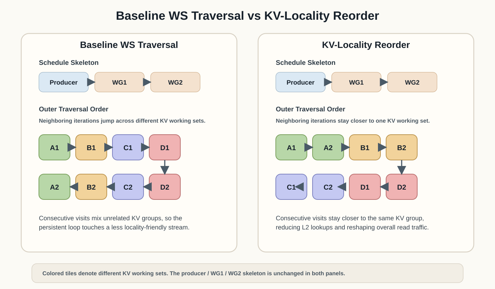

# Building A High-Performance Hopper WS GQA Kernel: From FA3-Inspired Scheduling To Systematic Optimization

## Introduction

Grouped Query Attention (GQA) is now a central building block in large language
model inference. It reduces the `K/V` footprint relative to full multi-head
attention, improves serving efficiency at long context, and therefore appears
throughout modern prefill and decode workloads. Because GQA sits directly on
the critical path of end-to-end latency, its kernel efficiency matters not only
for isolated microbenchmarks but for practical AI systems.

Algorithm papers usually explain these kernels primarily through the lens of
computation and scheduling principles. That perspective is necessary, but it is
not sufficient to obtain a near-SOTA operator in practice. Once the target is a
real high-performance GPU implementation, the remaining gap is no longer purely
algorithmic: it also depends on how the schedule interacts with the hardware
execution model, how the compiler lowers that schedule into concrete
tensor-core code, and how the workload itself exposes or limits optimization
freedom.

This challenge is particularly visible for GQA on modern high-performance
GPUs. Hopper provides a representative example because its warp-specialized
(WS) programming regime is both powerful and highly specific, built around
warpgroup-level tensor-core execution, explicit producer-consumer
orchestration, and tight interaction among `TMA`, `WGMMA`, shared memory, and
register allocation. These mechanisms create large performance opportunities,
but they also make kernel behavior much more sensitive to schedule shape,
locality policy, synchronization placement, compiler-lowered register flow,
and workload structure than in more conventional CTA-level designs.

FlashAttention-3 (FA3) is the key prior reference point in this setting. FA3
shows that high-performance Hopper attention is not achieved by arithmetic
formulation alone; it also depends on a carefully designed warp-specialized
schedule. However, taking that algorithmic direction and turning it into a
different high-performance operator stack still requires substantial systems
work. The core problem is therefore not just to "use the FA3 idea", but to
close the engineering gap between an algorithmic recipe and a practically
efficient kernel.

This report studies that gap in the `TileOPs` operator library, using
`TileLang` as the kernel construction framework. Starting from the design
direction suggested by FA3, we build a Hopper warp-specialized GQA forward
kernel in TileOps and then systematically close the remaining implementation
gap through hardware-facing analysis. Starting from that FA3-inspired
warp-specialized direction, this report develops a systematic optimization path
with three main layers:

1. `Single-CTA WGMMA Pipeline -> Baseline WS Pipeline` is a schedule win.
2. `Baseline WS Pipeline -> KV-Locality Reorder` is a memory-system win.
3. `KV-Locality Reorder -> Post-wait0 Delayed Rescale` is a register-flow win.

Beyond this three-step mainline, the report also studies a separate
workload-aware issue-scheduling problem above the tile level. For causal GQA,
the workload structure leaves nontrivial freedom in how outer work items are
issued, grouped, and ordered. We treat this as an additional schedule-design
dimension rather than as a fourth step in the kernel mainline, and use the
paired-vs-single-tile comparison as a concrete probe of that design space. This
lets us separate which part of the remaining long-sequence gap to FA3 is really
coming from outer scheduling rather than from the intra-tile compute body
itself.

The broader claim of this report is not limited to one kernel revision on one
GPU. For compute-bound operators, especially those that depend strongly on
tensor-core utilization, near-SOTA performance often requires closing the gap
between algorithm design and implementation reality. That means jointly
reasoning about schedule freedom, hardware locality, compiler effects, and
workload structure rather than treating them as separate concerns. In that
sense, the methods documented here are relevant beyond Hopper itself. They
should also be useful for future tensor-core-dominated architectures,
including platforms such as Blackwell, where the exact instructions may change
but the need for coordinated schedule, memory, and register design remains.

## End-To-End Results Vs FA3

Before analyzing mechanisms, we first summarize the end-to-end outcome on a set
of production-prefill shapes measured against FA3 on the same GPU. This table
is not meant to replace the later causal analysis; rather, it establishes the
practical performance envelope that the rest of the report aims to explain. For
the final causal entry, we report the best available anchor strategy per shape:
either the original paired anchor or the newer single-tile outer-scheduler
variant.

| Shape | Baseline WS ms | Reorder ms | Best Anchor ms | Anchor Variant | FA3 ms | Best Anchor TFLOPS | FA3 TFLOPS | Best Anchor / FA3 TFLOPS |
| --- | ---: | ---: | ---: | :-- | ---: | ---: | ---: | ---: |
| llama8b-4k | 0.3165 | 0.3099 | 0.2665 | paired | 0.2758 | 515.8 | 498.3 | 103.5% |
| llama8b-8k | 1.0321 | 0.9938 | 0.9151 | paired | 0.8371 | 600.7 | 656.7 | 91.5% |
| llama8b-32k | 17.0063 | 16.2642 | 14.3983 | single-tile | 12.9126 | 610.9 | 681.2 | 89.7% |
| llama8b-128k | 273.6086 | 267.2308 | 254.9966 | paired | 216.1482 | 551.9 | 651.1 | 84.8% |
| llama8b-256k | 1130.9110 | 1081.5928 | 1033.3350 | paired | 873.7935 | 544.8 | 644.3 | 84.5% |
| llama70b-4k | 0.5636 | 0.5575 | 0.4863 | paired | 0.4680 | 565.2 | 587.3 | 96.2% |
| llama405b-4k | 1.0463 | 1.0164 | 0.9440 | paired | 0.8598 | 582.4 | 639.4 | 91.1% |

Several observations are immediate.

- At `4k`, the final anchor-style kernel is already close to FA3, and on
  `llama8b-4k` it is slightly faster in elapsed time on this measurement set.
- The first WS milestone is the dominant structural step-change. Later
  milestones matter, but they build on top of a new execution organization
  rather than rescuing an already-good kernel.
- At longer contexts, the path still helps materially, but it does not fully
  close the remaining gap to FA3. That is exactly why the later sections
  separate schedule, memory-system, and register-flow effects instead of
  treating them as one undifferentiated story.

The `Best Anchor` column is intentionally dispatch-oriented. For the
`llama8b` causal rows, it takes the better of the paired and single-tile
anchor strategies from a follow-up paired-vs-single sweep. For the larger-model
`4k` rows, only the paired anchor has been measured so far, so `Best Anchor`
remains the paired result there.

The `llama8b-256k` row was added in a follow-up run under the same measurement
setup as the rest of the table.

## Setup

We evaluate the evolution path on one representative causal analysis point,
`B=4, S=4096, H=64, Hkv=8, D=128`, and we also track end-to-end prefill
performance on production-aligned shapes. All milestone comparisons are taken
on the same GPU and under the same environment so that schedule effects,
locality effects, and codegen effects can be compared directly rather than
through anecdotal profiler screenshots. The hardware target throughout this
report is `NVIDIA H200`, which provides the Hopper execution model discussed in
the introduction and also explains the later use of `V2P_NUM_SMS=132` for the
persistent-kernel measurements.

The production-prefill sweep already indicates the overall trend, but the core
goal of this report is explanatory rather than merely comparative.

The measurement discipline matters for the later mechanistic argument. End-to-
end latency is measured in fresh worker subprocesses with identical input
construction, `torch.cuda.Event` timing, `3` warmup iterations, and `7`
measured iterations, with the reported number taken as the median elapsed time.
Keeping each variant in its own subprocess avoids import and codegen pollution
across different TileOps worktrees. The production sweep and the canonical
`4k` comparison were both run serially on the same visible Hopper device
(`CUDA_VISIBLE_DEVICES=1` in the manifest), with the same TileLang
environment and the same `V2P_NUM_SMS=132` setting for the persistent kernels.

Cycle-level timeline splits come from instrumented benchmark kernels that place
inline `clock64` probes around specific steady-state regions such as `QK`
issue, `PV` issue, `wait<1>`, `wait<0>`, softmax-side work, barrier waits, and
scheduler handoff. Those probes accumulate per-region cycle deltas into timing
buffers inside the kernel, which is why later figures can discuss local windows
like `qk_issue`, `softmax_core`, or `wait_v_full` instead of relying only on
whole-kernel runtime. The one exception is the pre-WS baseline: in this
environment, fine-grained in-loop WGMMA timing still triggers a
`WgmmaSyncRewriter` crash, so the pre-WS node is represented with coarse timing
rather than with the same internal split used for the WS milestones.

Nsight Compute is used in two separate roles. First, we collect tensor-pipe
activity on the canonical `4k` shape, using
`sm__pipe_tensor_cycles_active.avg.pct_of_peak_sustained_elapsed` and related
GMMA counters to check whether milestones change the amount of tensor-core work
or mainly change how well it is packed. Second, we collect L2-facing metrics
such as read lookups, read misses, `lts__t_bytes`, and `dram__bytes_read` to
test the locality claims in the reorder and long-sequence scheduler sections.
These NCU runs are also kept serial, and they bracket exactly one profiled
kernel invocation with `cudaProfilerStart/Stop` so that the reported counters
are tied to one steady measurement window rather than to process startup noise.
NCU temporary files are redirected under `.tmp/ncu` to keep the profiler runs
stable across repeated sweeps.

Taken together, we use multiple evidence types:

- end-to-end latency
- cycle-level timeline splits
- tensor-pipe utilization
- generated CUDA, `ptxas`, and SASS
- Nsight Compute memory-system counters

That combination matters because it lets us separate "does less work" from
"does the same work with a better schedule."

## 1. Single-CTA Baseline

The pre-WS baseline for this study is the existing Hopper-oriented single-CTA
WGMMA pipeline, which we refer to as the `Single-CTA WGMMA Pipeline`. This
baseline already uses WGMMA and software pipelining, so it should be viewed as
a competent predecessor rather than as an artificially weak comparison point.

Its structural limitation is that one CTA still owns the entire local loop over
`K/V` tiles. In each iteration of that loop, the same CTA is responsible for
staging the next `K/V` tile, issuing the `QK` tensor-core work, updating the
online softmax state, issuing the `PV` tensor-core work, and then advancing the
pipeline to the next tile. The kernel may overlap adjacent iterations through
software pipelining, but that overlap is still local to one CTA-controlled
execution path. There is no explicit producer warp group, no consumer handoff,
and no stable two-consumer ping-pong. As a result, Tensor Core activity is
gated by the progress of one CTA-local schedule.

*Figure 1. Execution model of the pre-WS `Single-CTA WGMMA Pipeline`. One CTA
stages `K/V`, executes the `QK -> softmax -> PV` sequence, and advances the
software pipeline across tiles without explicit warp-group specialization.*

Figure 1 should be read exactly in that order. The left side represents one
CTA-local pipeline rather than separate execution roles. The CTA first prepares
the next tile's `K/V` state, then enters the `QK` compute phase, carries the
intermediate values through the online softmax update, and finally issues the
`PV` phase before moving on to the next loop iteration. Any overlap that exists
comes from pipelining neighboring iterations of this single control path, not
from handing work across specialized warp groups.

This distinction matters for the interpretation of the entire report. The later
milestones are organized around explicit producer / consumer handoff between
specialized warp groups, whereas the pre-WS baseline is better understood as a
single-CTA software pipeline with only local overlap across loop iterations.
Accordingly, it serves as the correct reference point for identifying which
benefits come specifically from warp specialization.

## 2. Baseline WS As A Schedule Win

The first major gain comes from replacing the single-CTA structure with an
explicit warp-specialized schedule. This `Baseline WS Pipeline` is the primary
structural transition in the optimization path. It is not best understood as an
instruction-level cleanup; rather, it changes how data movement is assigned,
how consumption is partitioned, and how Tensor Core work is phased across the
CTA.

Concretely, the baseline WS milestone introduces three structural changes
relative to the single-CTA baseline. First, `K/V` movement is pulled into a
dedicated producer warp group instead of remaining fused with the consumer
body. Second, the consumer path is split into two warp groups, `WG1` and
`WG2`, with an explicit scheduler handoff between them so that one consumer can
release the next while the producer is already feeding future buffers. Third,
the kernel switches to the persistent WS execution style used in this study, so
the same resident CTA keeps stepping through macro-tiles instead of rebuilding
the local pipeline around a single CTA-owned loop body every time. Those are
visible execution-model changes, not local cleanups inside an otherwise
unchanged loop.

At the level of one steady-state cycle, the execution order is now different
from the single-CTA baseline. The producer warp group stages the next `K/V`
tile into shared memory while one consumer warp group issues `QK` / `PV`
tensor-core work on the current tile. When that consumer reaches its handoff
point, the second consumer warp group becomes eligible to issue the next
compute slice, so the CTA can maintain a producer-consumer-consumer rhythm
instead of forcing all phases through one CTA-local path.

*Figure 2. Steady-state execution model of the `Baseline WS Pipeline`. One
producer warp group stages future `K/V` tiles while two consumer warp groups
alternate tensor-core work through an explicit handoff protocol.*

At a high level, the schedule adopts the same class of information-flow idea
emphasized by the [FlashAttention-3 paper](https://tridao.me/publications/flash3/flash3.pdf):
one producer warp group feeds `K/V`, while two consumer warp groups alternate
their Tensor Core work. FA3 uses this warp-specialized producer-consumer design
to exploit Hopper asynchrony: `TMA`-based data movement can proceed in the
producer while consumers issue asynchronous `WGMMA`, and the consumer-side
organization creates room to overlap GEMM and softmax-side work more
effectively. That split matters here for the same reason. In the pre-WS
kernel, data movement and tensor-core issue remain chained behind one CTA-local
loop. In the WS kernel, they are explicitly staged and handed off between
specialized warp groups.

Figure 2 should be read as the steady-state definition of the FA3-aligned
schedule. The producer is
responsible only for preparing future tiles, while `WG1` and `WG2` alternate as
consumers on the current stream of work. That division is the key schedule
change in this section. The later locality and anchor optimizations do not
replace this schedule; they refine how work is ordered and how the same
schedule interacts with memory and registers.

The strongest evidence that this is a schedule win is that the Tensor Core work
does not materially change, but its packing does. Across the pre-WS and
baseline-WS milestones, GMMA work is essentially unchanged, yet tensor-pipe
utilization rises from `35.2%` to `60.0%`. The kernel is not doing less Tensor
Core math; it is feeding and phasing the same math more effectively.

This interpretation is also consistent with the FA3 ablation story. The FA3
paper reports that removing warp specialization or removing GEMM-softmax
pipelining each materially reduces throughput on Hopper, which reinforces the
same qualitative point made by our measurements: carefully structured overlap,
rather than reduced arithmetic, is what drives the efficiency gain.

This also matches the size of the end-to-end gain. The first WS milestone
delivers about `30% ~ 41%` lower latency across the production-aligned prefill
shapes we tracked. That is much easier to explain as an architectural schedule
change than as a small local cleanup.

The claim should still be phrased carefully. The point is not that this kernel
reproduces FA3 in a strict one-to-one sense. The more precise statement is that
it adopts the same class of information-flow organization: explicit warp
specialization, explicit staging, and tighter Tensor Core packing.

## 3. Reorder As A Memory-System Win

The next milestone, `KV-Locality Reorder`, should be read as a refinement on
top of the baseline WS schedule rather than as a new schedule definition. The
producer-consumer structure introduced in the previous section remains intact:
the kernel still uses the same `1 producer + 2 consumers` organization and the
same FA3-aligned steady-state execution model. What changes here is how that
schedule traverses the workload above the tile level.

More concretely, the original `PR871 base` kernel uses the earlier persistent
ordering, where neighboring outer work items can move across different query
groups and therefore across different `KV` heads. The reorder variant changes
that outer traversal into a `KV`-head-friendly persistent order: work is
grouped by batch and `KV` head first, and the GQA query-head groups that share
the same `KV` head are processed in sequence. So the compute body stays almost
the same, but the persistent loop stops bouncing as aggressively between
unrelated `K/V` working sets.

In the local steady-state split, the core windows barely move:

- `qk_issue`: `198 -> 200`
- `pv_issue`: `215 -> 216`
- `softmax_core`: `1309 -> 1313`

That is consistent with the actual source-level change. Reorder keeps nearly
the same consumer core body and nearly the same intra-tile compute sequence.
What changes is the traversal order of the persistent kernel: the work becomes
more `KV`-head-friendly, so neighboring iterations reuse a more similar `K/V`
working set. In other words, this step does not replace the warp-specialized
schedule from Section 2; it changes the visitation order and memory footprint
of that same schedule.

*Figure 3. `KV-Locality Reorder` keeps the same warp-specialized
producer-consumer schedule but changes the outer traversal order. The key
effect is that neighboring iterations touch a more similar `K/V` working set
than in the baseline WS traversal.*

The relevant `L2` property is temporal reuse under limited cache capacity.
Hopper's `L2` does not need every lookup to have a lower miss ratio in order to
help; it is already useful if the kernel revisits the same `K/V` footprint
before those lines are displaced. By keeping all query groups that share one
`KV` head closer together in time, reorder gives the cache a better chance to
retain those `K/V` lines across neighboring persistent iterations.

Yet total measured time still improves from `2919` cycles to `2841` cycles.
That makes a pure "better local compute schedule" explanation too weak. The
improvement is better explained as a memory-system change.

The new Nsight Compute L2 pass sharpens that claim. Reorder does not simply
lower the L2 miss rate. On the canonical shape, the read miss ratio actually
increases from `0.0808` to `0.1145`. What drops instead is total traffic:

- total L2 read lookups: `656k -> 388k`
- absolute L2 read misses: `53.0k -> 44.5k`
- DRAM read bytes: `8.04M -> 7.00M`

So the better description is not "lower miss-rate win." It is a
memory-system-facing traffic-shaping win: reorder reduces how much read traffic
the WS schedule generates, even if the remaining stream does not have a lower
miss ratio.

That is also the concrete measured effect. Relative to `PR871 base`, reorder
reduces total `L2` read lookups from `656k` to `388k`, reduces absolute `L2`
read misses from `53.0k` to `44.5k`, reduces DRAM read bytes from `8.04M` to
`7.00M`, and improves the measured total from `2919` to `2841` cycles. So the
best current reading is: reorder works by making the WS schedule consume a
smaller and more locality-friendly `K/V` access stream, not by changing the
local arithmetic body or by naively improving miss rate alone.

This step is important because it narrows the remaining search space. Once the
schedule is structurally sound and the memory-system footprint is smaller, the
last gap to the final kernel is no longer well explained by locality alone.

## 4. Delayed Rescale As A Register-Flow Win

The last major gain comes from moving `rescale(acc_o)` to after `wait0`. At
first glance the result looks contradictory, because some launch-side windows
become much larger:

- `qk_issue`: `200 -> 1066`
- `pv_issue`: `216 -> 941`

At the source level, the anchor variant is best understood as a small but
coordinated rewrite of the consumer loop rather than as one isolated line move.
For a reader who wants to reproduce the direction, the practical recipe is:

1. Split the consumer loop into a first-tile path (`n_idx == 0`) and a
   steady-state path (`n_idx > 0`).
2. Keep the first-tile path close to the old behavior: `QK -> wait -> fence
   acc_s -> softmax -> copy(acc_s_cast)`, with no `PV` yet.
3. In the steady-state path, issue `PV` before the softmax-side reduction is
   fully drained, then replace the generic `wait_wgmma<1>()` / `wait_wgmma<0>()`
   pair with explicit anchor waits `wait_wgmma_anchor<1>()` and
   `wait_wgmma_anchor<0>()`.
4. Move `rescale(acc_o)` out of the old `pre-PV` region and place it only after
   the anchored `wait<0>` and `v_empty` handoff.
5. For the causal kernel, keep the post-WGMMA mask as a separate branch on the
   last `K` block (`n_idx == loop_range - 1`) so that masking is applied after
   the `QK` update, not by pre-filling the accumulator.

This is why the anchor result should not be described as "just delayed
rescale". The rescale move is the dominant source-level simplification, but it
works together with an explicit first-tile / steady-state branch split and with
anchored wait placement around the `QK -> softmax -> PV` boundary.

Here the exact code motion is the key fact. In `reorder`, the old output path
still performs `rescale(acc_o)` before `PV`. In the delayed-rescale variant,
that work is removed from the `pre-PV` region and moved to after `wait0`. The
full anchor kernel keeps that same post-`wait0` placement and layers its own
wait-placement cleanup on top, but the isolated delayed-rescale-only result
shows that the rescale move is already the dominant source-level change.

But the kernel still gets faster overall:

| Milestone | Measured total cycles |
|:--|--:|
| `reorder` | `2841` |
| `reorder + delayed rescale only` | `2716` |
| `anchor` | `2668` |

The reason is that delayed rescale does not make `QK` or `PV` arithmetic
intrinsically cheaper. It changes where the hazard cost is paid.

In `reorder`, the old output path `acc_o *= ss` still lives before `PV`. That
forces one crowded region to carry the current `acc_s` path, the softmax state,
the casted `acc_s` values consumed by `PV`, and the old output accumulator path
at the same time. In the delayed-rescale variant, the `acc_o` path moves to
after `wait0`, so the hottest `pre-PV -> wait1 -> softmax` region becomes much
cleaner.

The anchor-specific waits matter because they change where the consumer loop is
allowed to fence the two accumulator families. In the old reorder kernel, the
compiler-facing structure is roughly:

- `QK`
- generic `wait<1>` and `fence(acc_s)`
- softmax-side work
- generic `wait<0>` and `fence(acc_o)`
- `rescale(acc_o)`

In the anchor kernel, the steady-state path becomes closer to:

- `QK`
- `PV`
- `wait_wgmma_anchor<1>` and `fence(acc_s)`
- softmax-side work
- `wait_wgmma_anchor<0>` and `fence(acc_o)`
- `v_empty`
- delayed `rescale(acc_o)`

That reorganization does two things together. First, it shortens the live
range overlap between `acc_o`, `acc_s`, softmax temporaries, and the casted
`acc_s` path consumed by `PV`. Second, it exposes a different dependence shape
to the compiler, so the generated `WARPGROUP/HGMMA` schedule is no longer the
same as in `reorder`.

The delayed-rescale-only experiment is the key isolating test. Without adding
the rest of the anchor machinery, moving rescale alone already reproduces most
of the final shape: `softmax_core` drops from `1313` to `1056`, close to
anchor's `1030`, and total time improves from `2841` to `2716`.

*Figure 4. Timeline comparison across milestones. In the anchor section, this
figure highlights which hot windows are actually reshaped by the final
register-flow cleanup on top of the earlier WS and locality improvements.*

Figure note: the front-end, detailed core, and tail panels come from different
probes and should not be summed as a runtime. The updated core split is meant
to remove the ambiguity of the older coarse `issue` / `softmax` labels by
separating `QK`, rescale, `wait(v)`, `PV`, preamble, and softmax core. The NCU
panel uses `sm__pipe_tensor_cycles_active.avg.pct_of_peak_sustained_elapsed` on
the canonical `4k` causal shape; GMMA work is essentially unchanged across
these WS milestones, but tensor-pipe utilization rises.

The codegen evidence makes the mechanism concrete. At the generated CUDA level,
the `QK` loops still look broadly similar across `reorder`,
`delayed-rescale-only`, and `anchor`. But the generated SASS is very different:

- `reorder` lowers `QK` into a relatively compact `HGMMA` burst
- `delayed-rescale-only` and `anchor` interleave almost every `HGMMA` with
  `WARPGROUP.DEPBAR + ARRIVE`

The `ptxas` diagnostics point in the same direction. `reorder` gets injected
`warpgroup.wait` and spills, while `delayed-rescale-only` and `anchor` instead
expose WGMMA serialization hazards tied to accumulator access.

So the most defensible interpretation is a coupled one: the source-level
register-flow change causes the compiler to lower the same logical `QK/PV`
stages into a different Hopper `WARPGROUP/HGMMA` schedule, and that new
schedule interacts differently with real accumulator-pipeline constraints.

The important reproducibility lesson is therefore not "copy this exact anchor
primitive". It is: if a WS attention kernel still carries both `acc_s` and
`acc_o` pressure through the same `pre-PV -> wait1 -> softmax` region, then a
good next experiment is to introduce an explicit steady-state branch, push the
old-output rescale past the final `wait`, and force the `acc_s` and `acc_o`
fences to occur at separate anchored synchronization points. That is the source
pattern that produced the better register-flow behavior here.

This also explains the apparent paradox of longer `QK/PV` windows but better
steady-state throughput. The cost does not disappear; it moves. `reorder`
appears to pay more in the downstream `wait1 / softmax-side` region through
spills and injected waits. Delayed rescale pays more in the launch-side
`QK/PV` windows, but it makes the downstream hot window much cleaner, and that
trade is favorable for end-to-end throughput.

*Figure 5. Full-cycle view of the final warp-specialized schedule family. In
this context, the figure should be read as showing how the reorder and anchor
improvements affect the overall execution rhythm on top of the same WS
foundation, rather than as the initial definition of warp specialization.*

Figure 5 complements Figure 4 by moving from local hot windows to whole-cycle
behavior. The stitched timelines explain where the anchor kernel cleans up the
critical steady-state path. The full-cycle view shows the broader consequence:
once those local hazards are reduced, the overall producer-consumer schedule
can sustain a cleaner rhythm across the entire macro-cycle, not just inside one
isolated sub-window.

## 5. A Causal-Specific Scheduler Choice: Paired Vs Single-Tile

The three-step mainline above explains how the final anchor kernel emerged, but
it does not fully explain the remaining long-sequence gap to FA3. That gap led
to one more causal-specific optimization question above the tile level: once
the inner compute body is already strong, how should the outer scheduler issue
causal tiles whose costs are highly non-uniform?

Causal attention is special here because different tiles do not carry the same
amount of work. Tiles far from the causal diagonal see a much larger valid
`K/V` span, so they run as heavy tiles; tiles closer to the diagonal see a much
shorter valid span, so they run as light tiles. This means the causal triangle
is not only sparse in shape, but also strongly imbalanced in per-tile cost.

That imbalance makes naive token-order issuance problematic. If the outer
scheduler simply walks tiles in forward token order, then the remaining work
tends to become increasingly bottom-heavy: light tiles retire early, while the
heavy tiles near the bottom of the triangle accumulate into a long tail. The
kernel is then paced by a small number of late heavy work items, even when the
average tile cost looks acceptable. So for causal GQA, outer issue scheduling
is not a cosmetic detail; it is part of the performance-critical design space.

That leaves two natural strategies. The current anchor kernel uses a paired
outer work unit `(k, M-1-k)` to flatten the triangle imbalance statically:
each outer work item binds one light tile from the top of the triangle with one
heavy tile from the bottom. This is a direct load-balancing response, and it is
especially sensible at short sequence lengths. The alternative is the FA3-style
direction: keep single-tile work units, then recover balance through a
reverse-`m_block` issue order, query-head-space sectioning, and dynamic
persistent issuance. In other words, paired scheduling reduces the imbalance by
changing the work unit, while reverse-block single-tile scheduling keeps the
work unit fine-grained and lets the outer scheduler react more flexibly.

To separate these two strategies, we built a single-tile outer-scheduler
variant that keeps the inner anchor compute body largely unchanged while
removing pairing from the outer work unit. The result is not a new mainline
kernel yet, but it is already useful as a design probe.

The schematic above uses a small causal example to show the difference in
grouping and traversal. The paired strategy directly cancels part of the
triangle imbalance by binding one light tile and one heavy tile into the same
outer work item. The single-tile strategy instead keeps each tile independent
and lets the outer scheduler issue them one at a time in reverse `m_block`
order. Both still operate inside the same query-head section, but they expose
very different ways of handling the causal long-tail problem: static balancing
inside each work item versus finer-grained reverse-block issuance.

| Shape | Paired Anchor ms | Single-Tile ms | Single / Paired |
| --- | ---: | ---: | ---: |
| llama8b-4k | 0.2665 | 0.3428 | 128.6% |
| llama8b-8k | 0.9151 | 1.0156 | 111.0% |
| llama8b-16k | 3.4973 | 3.4788 | 99.5% |
| llama8b-32k | 15.2967 | 14.3983 | 94.1% |
| llama8b-64k | 61.8354 | 60.4092 | 97.7% |
| llama8b-128k | 254.9966 | 256.7521 | 100.7% |
| llama8b-256k | 1033.3350 | 1034.1890 | 100.1% |

This table shows a real crossover region rather than one monotonic switch
point. Pairing is the right outer strategy for small shapes, where the causal
imbalance is modest enough that the coarse but well-balanced paired work unit
wins. Around `16k`, the two become nearly identical. At `32k-64k`, single-tile
becomes meaningfully better, which is consistent with the idea that
long-sequence causal tails benefit from finer outer issue control. By
`128k-256k`, the single-tile outer scheduler remains competitive but no longer
holds a decisive end-to-end advantage on its own.

The Nsight Compute data makes that last point more precise. At `64k`, `128k`,
and `256k`, the single-tile outer scheduler consistently produces a more
FA3-like memory-system signature:

- lower L2 miss rate
- lower or comparable DRAM read
- higher total L2 bytes

So single-tile is not a dead end. It really does release some scheduler freedom
and improve cache behavior. But it is also not a complete explanation by
itself. In this report, that result is best read as a new causal-specific
design lesson rather than as a replacement for the earlier three-step story:

- pairing is still the right outer strategy for short contexts
- single-tile becomes the more interesting outer strategy once context grows
- but closing the residual long-sequence gap still requires more than just
  changing scheduler granularity

This also suggests a practical dispatch intuition for future kernels. The
current data supports treating outer scheduler granularity as a workload-aware
policy choice, not as one fixed causal default. In practice, paired scheduling
is still the safer short-context policy, while the `16k-64k` range is already a
useful region for benchmarking single-tile outer scheduling as an alternative
that may recover more FA3-like issue freedom.

## 6. Conclusion: What The Evolution Path Teaches

Taken together, the path is not one long blur of tuning. It now has a cleaner
structure than before:

- `Single-CTA -> Baseline WS`: schedule / information-flow win
- `Baseline WS -> Reorder`: memory-system / locality win
- `Reorder -> Delayed Rescale`: register-flow win
- causal outer issue scheduling: an additional tile-level schedule-design freedom

That decomposition gives each step a distinct role. First, make the producer /
consumer schedule explicit. Then reduce the memory-system footprint of that
schedule. Then clean up the register and accumulator flow inside the consumer
hot window. Separately, for causal kernels, analyze the workload structure above
the tile and choose the outer issue scheduling policy that best matches the
target sequence-length regime.

This last point slightly refines the earlier summary. The three-step mainline
is still the right explanation for how the anchor kernel itself emerged. But
the follow-up paired-vs-single experiment shows that causal scheduling exposes
one more important degree of freedom above that mainline: how tiles should be
grouped and issued once per-tile workload imbalance becomes large. In this
report, that extra freedom is studied through the choice between paired
`(k, M-1-k)` work units and FA3-like single-tile issuance.

The practical design lesson from the delayed-rescale step remains the same. It
is not "add more waits." It is "use waits as stage boundaries." `wait1` and
`wait0` are useful because they separate regions with different live values and
different accumulator pressure. In WS kernels, heavy old-state repair work
should stay away from the current hot path whenever possible.

The practical design lesson from the new causal scheduler result is complementary:

- paired scheduling is still the better short-context strategy
- single-tile scheduling becomes more attractive once context grows
- scheduler granularity should therefore be treated as a dispatch decision, not
  as one fixed causal-kernel law

## 7. Appendix: Explored Directions With Limited Impact

Several side paths were still worth recording even though they did not become
the main explanation for the final kernel. They helped narrow the design space,
rule out tempting but incomplete stories, and clarify which constraints were
methodological rather than algorithmic. We collect them here as appendix-style
notes rather than as part of the mainline optimization path.

- More aggressive overlap variants helped map the design space, but the winning
  story was not "more overlap at any cost." The gains were better explained by
  schedule quality, memory-system footprint, and register-flow cleanup.
- Zero-clear and `ScaleOut::Zero` were not a general fix for the causal path.
  The working fix was to move the mask to a post-WGMMA point where the dataflow
  was already stable.
- Wait placement mattered more than simply "release earlier." The high-value
  lesson was to use `wait1` and `wait0` to keep heavy data paths from colliding
  in the same hot window.
- Some limitations were methodological. Fine-grained in-loop timing for the
  pre-WS kernel still hits a TileLang/TVM `WgmmaSyncRewriter` crash in this
  environment, so the pre-WS node has coarse timing but not the same internal
  split as the WS milestones.

## Summary

The central result is that this kernel evolution path contains one large
schedule win followed by two hardware-facing refinements. Baseline WS wins by
reorganizing information flow. Reorder wins by shrinking the memory-system
footprint. Delayed rescale wins by moving heavy register and accumulator
pressure out of the hottest consumer window. Beyond that three-step mainline,
causal GQA also exposes an additional tile-level issue-scheduling degree of
freedom, which should be analyzed through workload shape rather than treated as
a fixed kernel law.
