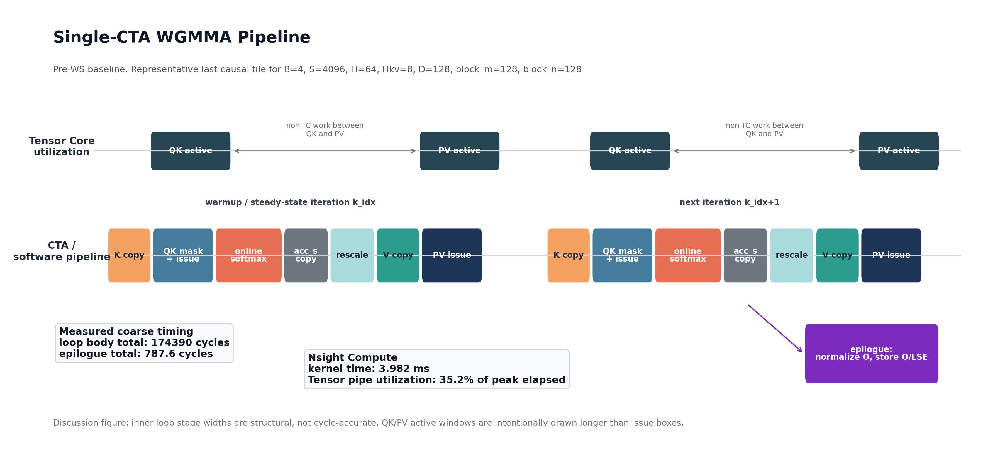
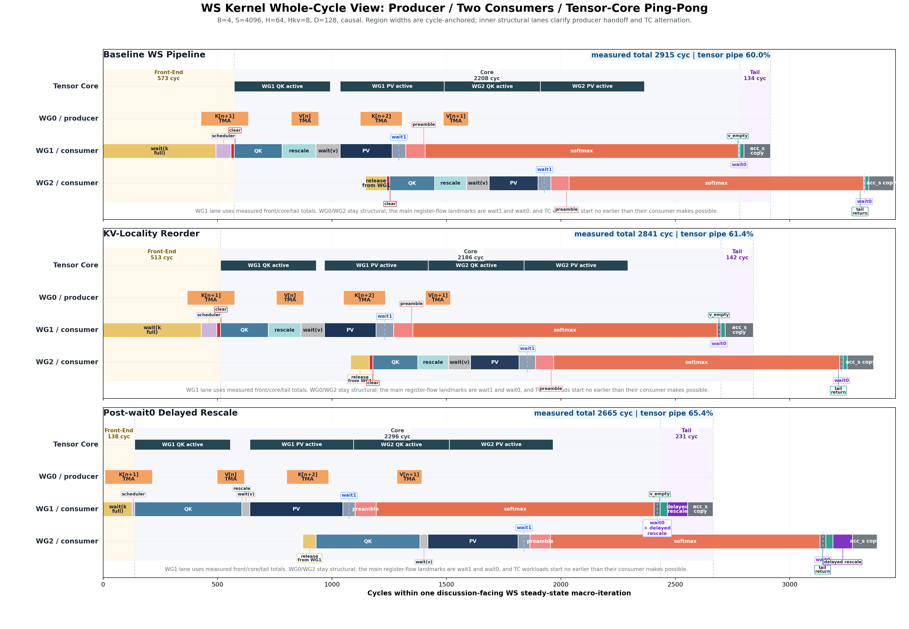
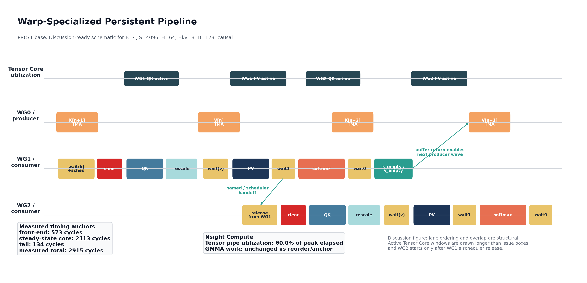
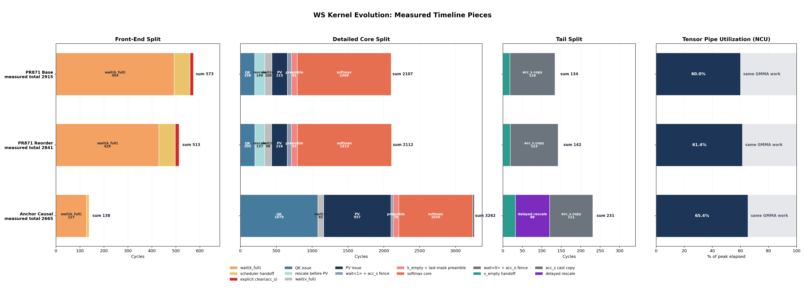
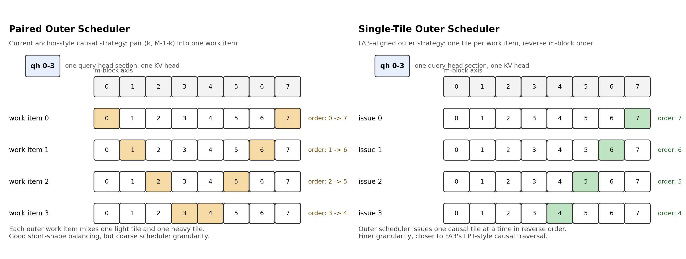

# WS Kernel Evolution: From Schedule Redesign To Hardware-Facing Refinements

## Introduction

Grouped Query Attention (GQA) is now a central building block in large language
model inference. It reduces the `K/V` footprint relative to full multi-head
attention, improves serving efficiency at long context, and therefore appears
throughout modern prefill and decode workloads. Because GQA sits directly on
the critical path of end-to-end latency, its kernel efficiency matters not only
for isolated microbenchmarks but for practical AI systems.

Algorithm papers usually explain these kernels primarily through the lens of
computation and scheduling principles. That perspective is necessary, but it is
not sufficient to obtain a near-SOTA operator in practice. Once the target is a
real high-performance GPU implementation, the remaining gap is no longer purely
algorithmic: it also depends on how the schedule interacts with the hardware
execution model, how the compiler lowers that schedule into concrete
tensor-core code, and how the workload itself exposes or limits optimization
freedom.

This challenge is particularly visible for GQA on modern high-performance
GPUs. Hopper provides a representative example because its warp-specialized
(WS) programming regime is both powerful and highly specific, built around
warpgroup-level tensor-core execution, explicit producer-consumer
orchestration, and tight interaction among `TMA`, `WGMMA`, shared memory, and
register allocation. These mechanisms create large performance opportunities,
but they also make kernel behavior much more sensitive to schedule shape,
locality policy, synchronization placement, compiler-lowered register flow,
and workload structure than in more conventional CTA-level designs.

FlashAttention-3 (FA3) is the key prior reference point in this setting. FA3
shows that high-performance Hopper attention is not achieved by arithmetic
formulation alone; it also depends on a carefully designed warp-specialized
schedule. However, taking that algorithmic direction and turning it into a
different high-performance operator stack still requires substantial systems
work. The core problem is therefore not just to "use the FA3 idea", but to
close the engineering gap between an algorithmic recipe and a practically
efficient kernel.

This report studies that gap in the `TileOPs` operator library, using
`TileLang` as the kernel construction framework. Starting from the design
direction suggested by FA3, we build a Hopper warp-specialized GQA forward
kernel in TileOps and then systematically close the remaining implementation
gap through hardware-facing analysis. In particular, we show that the causal
workload releases real schedule freedom, and that this freedom can be exploited
to improve `L2` locality, register behavior, and overall tensor-core packing.
Starting from that observation, this report develops a systematic optimization
path with three layers:

1. `Single-CTA WGMMA Pipeline -> Baseline WS Pipeline` is a schedule win.
2. `Baseline WS Pipeline -> KV-Locality Reorder` is a memory-system win.
3. `KV-Locality Reorder -> Post-wait0 Delayed Rescale` is a register-flow win.

Beyond this three-step mainline, the report also studies a workload-aware
issue-scheduling problem above the tile level. For causal GQA, the workload
structure leaves nontrivial freedom in how outer work items are issued,
grouped, and ordered. We use the paired-vs-single-tile comparison as a
concrete probe of this issue-schedule design space, and as a way to explain
which part of the remaining long-sequence gap to FA3 is really coming from
outer scheduling rather than from the intra-tile compute body itself.

The broader claim of this report is not limited to one kernel revision on one
GPU. For compute-bound operators, especially those that depend strongly on
tensor-core utilization, near-SOTA performance often requires closing the gap
between algorithm design and implementation reality. That means jointly
reasoning about schedule freedom, hardware locality, compiler effects, and
workload structure rather than treating them as separate concerns. In that
sense, the methods documented here are relevant beyond Hopper itself. They
should also be useful for future tensor-core-dominated architectures,
including platforms such as Blackwell, where the exact instructions may change
but the need for coordinated schedule, memory, and register design remains.

## End-To-End Results Vs FA3

Before analyzing mechanisms, we first summarize the end-to-end outcome on a set
of production-prefill shapes measured against FA3 on the same GPU. This table
is not meant to replace the later causal analysis; rather, it establishes the
practical performance envelope that the rest of the report aims to explain. For
the final causal entry, we report the best available anchor strategy per shape:
either the original paired anchor or the newer single-tile outer-scheduler
variant.

| Shape | Base ms | Reorder ms | Best Anchor ms | Anchor Variant | FA3 ms | Best Anchor TFLOPS | FA3 TFLOPS | Best Anchor / FA3 TF |
| --- | ---: | ---: | ---: | :-- | ---: | ---: | ---: | ---: |
| llama8b-4k | 0.3165 | 0.3099 | 0.2665 | paired | 0.2758 | 515.8 | 498.3 | 103.5% |
| llama8b-8k | 1.0321 | 0.9938 | 0.9151 | paired | 0.8371 | 600.7 | 656.7 | 91.5% |
| llama8b-32k | 17.0063 | 16.2642 | 14.3983 | single-tile | 12.9126 | 610.9 | 681.2 | 89.7% |
| llama8b-128k | 273.6086 | 267.2308 | 254.9966 | paired | 216.1482 | 551.9 | 651.1 | 84.8% |
| llama8b-256k | 1130.9110 | 1081.5928 | 1033.3350 | paired | 873.7935 | 544.8 | 644.3 | 84.5% |
| llama70b-4k | 0.5636 | 0.5575 | 0.4863 | paired | 0.4680 | 565.2 | 587.3 | 96.2% |
| llama405b-4k | 1.0463 | 1.0164 | 0.9440 | paired | 0.8598 | 582.4 | 639.4 | 91.1% |

Several observations are immediate.

- At `4k`, the final anchor-style kernel is already close to FA3, and on
  `llama8b-4k` it is slightly faster in elapsed time on this measurement set.
- The first WS milestone is the dominant structural step-change. Later
  milestones matter, but they build on top of a new execution organization
  rather than rescuing an already-good kernel.
- At longer contexts, the path still helps materially, but it does not fully
  close the remaining gap to FA3. That is exactly why the later sections
  separate schedule, memory-system, and register-flow effects instead of
  treating them as one undifferentiated story.

The `Best Anchor` column is intentionally dispatch-oriented. For the
`llama8b` causal rows, it takes the better of the paired and single-tile
anchor strategies from a follow-up paired-vs-single sweep. For the larger-model
`4k` rows, only the paired anchor has been measured so far, so `Best Anchor`
remains the paired result there.

The `llama8b-256k` row was added in a follow-up run under the same measurement
setup as the rest of the table.

## Setup

We evaluate the evolution path on one representative causal analysis point,
`B=4, S=4096, H=64, Hkv=8, D=128`, and we also track end-to-end prefill
performance on production-aligned shapes. All milestone comparisons are taken
on the same GPU and under the same environment so that schedule effects,
locality effects, and codegen effects can be compared directly rather than
through anecdotal profiler screenshots.

The production-prefill sweep already indicates the overall trend, but the core
goal of this report is explanatory rather than merely comparative.

The measurement discipline matters for the later mechanistic argument. We use
multiple evidence types together:

- end-to-end latency
- cycle-level timeline splits
- tensor-pipe utilization
- generated CUDA, `ptxas`, and SASS
- Nsight Compute memory-system counters

That combination matters because it lets us separate "does less work" from
"does the same work with a better schedule."

## 1. Single-CTA Baseline

The pre-WS baseline for this study is the existing Hopper-oriented single-CTA
WGMMA pipeline, which we refer to as the `Single-CTA WGMMA Pipeline`. This
baseline already uses WGMMA and software pipelining, so it should be viewed as
a competent predecessor rather than as an artificially weak comparison point.

Its structural limitation is that one CTA still owns the entire local loop over
`K/V` tiles. In each iteration of that loop, the same CTA is responsible for
staging the next `K/V` tile, issuing the `QK` tensor-core work, updating the
online softmax state, issuing the `PV` tensor-core work, and then advancing the
pipeline to the next tile. The kernel may overlap adjacent iterations through
software pipelining, but that overlap is still local to one CTA-controlled
execution path. There is no explicit producer warp group, no consumer handoff,
and no stable two-consumer ping-pong. As a result, Tensor Core activity is
gated by the progress of one CTA-local schedule.

*Figure 1. Execution model of the pre-WS `Single-CTA WGMMA Pipeline`. One CTA
stages `K/V`, executes the `QK -> softmax -> PV` sequence, and advances the
software pipeline across tiles without explicit warp-group specialization.*

Figure 1 should be read exactly in that order. The left side represents one
CTA-local pipeline rather than separate execution roles. The CTA first prepares
the next tile's `K/V` state, then enters the `QK` compute phase, carries the
intermediate values through the online softmax update, and finally issues the
`PV` phase before moving on to the next loop iteration. Any overlap that exists
comes from pipelining neighboring iterations of this single control path, not
from handing work across specialized warp groups.

This distinction matters for the interpretation of the entire report. The later
milestones are organized around explicit producer / consumer handoff between
specialized warp groups, whereas the pre-WS baseline is better understood as a
single-CTA software pipeline with only local overlap across loop iterations.
Accordingly, it serves as the correct reference point for identifying which
benefits come specifically from warp specialization.

## 2. Baseline WS As A Schedule Win

The first major gain comes from replacing the single-CTA structure with an
explicit warp-specialized schedule. This `Baseline WS Pipeline` is the primary
structural transition in the optimization path. It is not best understood as an
instruction-level cleanup; rather, it changes how data movement is assigned,
how consumption is partitioned, and how Tensor Core work is phased across the
CTA.

Concretely, the baseline WS milestone introduces three structural changes
relative to the single-CTA baseline. First, `K/V` movement is pulled into a
dedicated producer warp group instead of remaining fused with the consumer
body. Second, the consumer path is split into two warp groups, `WG1` and
`WG2`, with an explicit scheduler handoff between them so that one consumer can
release the next while the producer is already feeding future buffers. Third,
the kernel switches to the persistent WS execution style used in this study, so
the same resident CTA keeps stepping through macro-tiles instead of rebuilding
the local pipeline around a single CTA-owned loop body every time. Those are
visible execution-model changes, not local cleanups inside an otherwise
unchanged loop.

At the level of one steady-state cycle, the execution order is now different
from the single-CTA baseline. The producer warp group stages the next `K/V`
tile into shared memory while one consumer warp group issues `QK` / `PV`
tensor-core work on the current tile. When that consumer reaches its handoff
point, the second consumer warp group becomes eligible to issue the next
compute slice, so the CTA can maintain a producer-consumer-consumer rhythm
instead of forcing all phases through one CTA-local path.

*Figure 2. Full-cycle view of the baseline warp-specialized schedule. The CTA
progresses through fill, steady state, and drain while maintaining the same
producer-plus-two-consumer execution structure.*

*Figure 3. Steady-state execution model of the `Baseline WS Pipeline`. One
producer warp group stages future `K/V` tiles while two consumer warp groups
alternate tensor-core work through an explicit handoff protocol.*

At a high level, the schedule adopts the same class of information-flow idea
emphasized by the [FlashAttention-3 paper](https://tridao.me/publications/flash3/flash3.pdf):
one producer warp group feeds `K/V`, while two consumer warp groups alternate
their Tensor Core work. FA3 uses this warp-specialized producer-consumer design
to exploit Hopper asynchrony: `TMA`-based data movement can proceed in the
producer while consumers issue asynchronous `WGMMA`, and the consumer-side
organization creates room to overlap GEMM and softmax-side work more
effectively. That split matters here for the same reason. In the pre-WS
kernel, data movement and tensor-core issue remain chained behind one CTA-local
loop. In the WS kernel, they are explicitly staged and handed off between
specialized warp groups.

Figure 2 provides the global view of the FA3-aligned schedule: the kernel is no
longer a single CTA-local software pipeline, but a warp-specialized execution
pattern that persists across fill, steady state, and drain. Figure 3 then zooms
in on the steady-state regime. The producer is
responsible only for preparing future tiles, while `WG1` and `WG2` alternate as
consumers on the current stream of work. That division is the key schedule
change in this section. The later locality and anchor optimizations do not
replace this schedule; they refine how work is ordered and how the same
schedule interacts with memory and registers.

The strongest evidence that this is a schedule win is that the Tensor Core work
does not materially change, but its packing does. Across the pre-WS and
baseline-WS milestones, GMMA work is essentially unchanged, yet tensor-pipe
utilization rises from `35.2%` to `60.0%`. The kernel is not doing less Tensor
Core math; it is feeding and phasing the same math more effectively.

This interpretation is also consistent with the FA3 ablation story. The FA3
paper reports that removing warp specialization or removing GEMM-softmax
pipelining each materially reduces throughput on Hopper, which reinforces the
same qualitative point made by our measurements: carefully structured overlap,
rather than reduced arithmetic, is what drives the efficiency gain.

This also matches the size of the end-to-end gain. The first WS milestone
delivers about `30% ~ 41%` lower latency across the production-aligned prefill
shapes we tracked. That is much easier to explain as an architectural schedule
change than as a small local cleanup.

The claim should still be phrased carefully. The point is not that this kernel
reproduces FA3 in a strict one-to-one sense. The more precise statement is that
it adopts the same class of information-flow organization: explicit warp
specialization, explicit staging, and tighter Tensor Core packing.

## 3. Reorder As A Memory-System Win

The next milestone, `KV-Locality Reorder`, should be read as a refinement on
top of the baseline WS schedule rather than as a new schedule definition. The
producer-consumer structure introduced in the previous section remains intact:
the kernel still uses the same `1 producer + 2 consumers` organization and the
same FA3-aligned steady-state execution model. What changes here is how that
schedule traverses the workload above the tile level.

In the local steady-state split, the core windows barely move:

- `qk_issue`: `198 -> 200`
- `pv_issue`: `215 -> 216`
- `softmax_core`: `1309 -> 1313`

That is consistent with the actual source-level change. Reorder keeps nearly
the same consumer core body and nearly the same intra-tile compute sequence.
What changes is the traversal order of the persistent kernel: the work becomes
more `KV`-head-friendly, so neighboring iterations reuse a more similar `K/V`
working set. In other words, this step does not replace the warp-specialized
schedule from Section 2; it changes the visitation order and memory footprint
of that same schedule.

Yet total measured time still improves from `2919` cycles to `2841` cycles.
That makes a pure "better local compute schedule" explanation too weak. The
improvement is better explained as a memory-system change.

The new Nsight Compute L2 pass sharpens that claim. Reorder does not simply
lower the L2 miss rate. On the canonical shape, the read miss ratio actually
increases from `0.0808` to `0.1145`. What drops instead is total traffic:

- total L2 read lookups: `656k -> 388k`
- absolute L2 read misses: `53.0k -> 44.5k`
- DRAM read bytes: `8.04M -> 7.00M`

So the better description is not "lower miss-rate win." It is a
memory-system-facing traffic-shaping win: reorder reduces how much read traffic
the WS schedule generates, even if the remaining stream does not have a lower
miss ratio.

*Figure 4. Timeline comparison across milestones. In this section, the reorder
milestone should be interpreted as a locality-oriented refinement layered on top
of the same baseline WS schedule, rather than as a different producer-consumer
execution model.*

This step is important because it narrows the remaining search space. Once the
schedule is structurally sound and the memory-system footprint is smaller, the
last gap to the final kernel is no longer well explained by locality alone.

## 4. Delayed Rescale As A Register-Flow Win

The last major gain comes from moving `rescale(acc_o)` to after `wait0`. At
first glance the result looks contradictory, because some launch-side windows
become much larger:

- `qk_issue`: `200 -> 1066`
- `pv_issue`: `216 -> 941`

Here the exact code motion is the key fact. In `reorder`, the old output path
still performs `rescale(acc_o)` before `PV`. In the delayed-rescale variant,
that work is removed from the `pre-PV` region and moved to after `wait0`. The
full anchor kernel keeps that same post-`wait0` placement and layers its own
wait-placement cleanup on top, but the isolated delayed-rescale-only result
shows that the rescale move is already the dominant source-level change.

But the kernel still gets faster overall:

| Milestone | Measured total cycles |
|:--|--:|
| `reorder` | `2841` |
| `reorder + delayed rescale only` | `2716` |
| `anchor` | `2668` |

The reason is that delayed rescale does not make `QK` or `PV` arithmetic
intrinsically cheaper. It changes where the hazard cost is paid.

In `reorder`, the old output path `acc_o *= ss` still lives before `PV`. That
forces one crowded region to carry the current `acc_s` path, the softmax state,
the casted `acc_s` values consumed by `PV`, and the old output accumulator path
at the same time. In the delayed-rescale variant, the `acc_o` path moves to
after `wait0`, so the hottest `pre-PV -> wait1 -> softmax` region becomes much
cleaner.

The delayed-rescale-only experiment is the key isolating test. Without adding
the rest of the anchor machinery, moving rescale alone already reproduces most
of the final shape: `softmax_core` drops from `1313` to `1056`, close to
anchor's `1030`, and total time improves from `2841` to `2716`.

The codegen evidence makes the mechanism concrete. At the generated CUDA level,
the `QK` loops still look broadly similar across `reorder`,
`delayed-rescale-only`, and `anchor`. But the generated SASS is very different:

- `reorder` lowers `QK` into a relatively compact `HGMMA` burst
- `delayed-rescale-only` and `anchor` interleave almost every `HGMMA` with
  `WARPGROUP.DEPBAR + ARRIVE`

The `ptxas` diagnostics point in the same direction. `reorder` gets injected
`warpgroup.wait` and spills, while `delayed-rescale-only` and `anchor` instead
expose WGMMA serialization hazards tied to accumulator access.

So the most defensible interpretation is a coupled one: the source-level
register-flow change causes the compiler to lower the same logical `QK/PV`
stages into a different Hopper `WARPGROUP/HGMMA` schedule, and that new
schedule interacts differently with real accumulator-pipeline constraints.

This also explains the apparent paradox of longer `QK/PV` windows but better
steady-state throughput. The cost does not disappear; it moves. `reorder`
appears to pay more in the downstream `wait1 / softmax-side` region through
spills and injected waits. Delayed rescale pays more in the launch-side
`QK/PV` windows, but it makes the downstream hot window much cleaner, and that
trade is favorable for end-to-end throughput.

## 5. A Causal-Specific Scheduler Choice: Paired Vs Single-Tile

The three-step mainline above explains how the final anchor kernel emerged, but
it does not fully explain the remaining long-sequence gap to FA3. That gap led
to one more causal-specific question: should the outer scheduler continue to use
the current paired causal work unit, or should it switch to a single-tile work
unit that more closely matches FA3's causal scheduler?

This is a causal-specific design choice because pairing is not arbitrary. The
current anchor kernel uses a paired outer work unit `(k, M-1-k)` to flatten the
causal triangle imbalance: each outer work item mixes one light tile from the
top of the triangle with one heavy tile from the bottom. That is a sensible
local balancing strategy, especially at short sequence lengths. But it also
makes the outer scheduler coarser. FA3 does not use this paired work unit. Its
causal scheduler issues single tiles, then relies on reverse-`m_block`
ordering, query-head-space sectioning, and dynamic persistent issuance to
recover load balance and locality.

To separate these two strategies, we built a single-tile outer-scheduler
variant that keeps the inner anchor compute body largely unchanged while
removing pairing from the outer work unit. The result is not a new mainline
kernel yet, but it is already useful as a design probe.

The schematic above uses a small causal example to show the difference in
grouping and traversal. The paired strategy binds one light tile and one heavy
tile into the same outer work item, while the single-tile strategy lets the
outer scheduler issue one tile at a time in reverse `m_block` order. Both still
operate inside the same query-head section, but they expose very different
scheduler granularity to the outer policy.

| Shape | Paired Anchor ms | Single-Tile ms | Single / Paired |
| --- | ---: | ---: | ---: |
| llama8b-4k | 0.2665 | 0.3428 | 128.6% |
| llama8b-8k | 0.9151 | 1.0156 | 111.0% |
| llama8b-16k | 3.4973 | 3.4788 | 99.5% |
| llama8b-32k | 15.2967 | 14.3983 | 94.1% |
| llama8b-64k | 61.8354 | 60.4092 | 97.7% |
| llama8b-128k | 254.9966 | 256.7521 | 100.7% |
| llama8b-256k | 1033.3350 | 1034.1890 | 100.1% |

This table shows a clear crossover shape. Pairing is the right outer strategy
for small shapes, where the extra scheduler freedom of single-tile does not pay
for itself. Around `16k`, the two become nearly identical. At `32k-64k`,
single-tile becomes meaningfully better. And by `128k-256k`, the single-tile
outer scheduler remains competitive but does not yet deliver a decisive
end-to-end win on its own.

The Nsight Compute data makes that last point more precise. At `64k`, `128k`,
and `256k`, the single-tile outer scheduler consistently produces a more
FA3-like memory-system signature:

- lower L2 miss rate
- lower or comparable DRAM read
- higher total L2 bytes

So single-tile is not a dead end. It really does release some scheduler freedom
and improve cache behavior. But it is also not a complete explanation by
itself. In this report, that result is best read as a new causal-specific
design lesson rather than as a replacement for the earlier three-step story:

- pairing is still the right outer strategy for short contexts
- single-tile becomes the more interesting outer strategy once context grows
- but closing the residual long-sequence gap still requires more than just
  changing scheduler granularity

This also suggests a practical dispatch intuition for future kernels. A
conservative policy would keep paired scheduling below `32k` and only consider
single-tile outer scheduling at `32k+`. An exploratory policy could already
treat `16k` as a crossover region worth benchmarking, while still keeping
paired scheduling as the safer default there.

## 6. What The Evolution Path Teaches

Taken together, the path is not one long blur of tuning. It now has a cleaner
structure than before:

- `Single-CTA -> Baseline WS`: schedule / information-flow win
- `Baseline WS -> Reorder`: memory-system / locality win
- `Reorder -> Delayed Rescale`: register-flow win
- `Paired -> Single-Tile (causal outer scheduler choice)`: scheduler-granularity tradeoff

That decomposition gives each step a distinct role. First, make the producer /
consumer schedule explicit. Then reduce the memory-system footprint of that
schedule. Then clean up the register and accumulator flow inside the consumer
hot window. Finally, for causal kernels, choose the right outer scheduling
granularity for the target sequence-length regime.

This last point slightly refines the earlier summary. The three-step mainline is
still the right explanation for how the anchor kernel itself emerged. But the
follow-up paired-vs-single experiment shows that causal scheduling has one more
important degree of freedom above that mainline: whether the outer scheduler
should balance work by pairing `(k, M-1-k)` tiles, or recover FA3-like
single-tile freedom and let the policy react more directly to sequence length.

The practical design lesson from the delayed-rescale step remains the same. It
is not "add more waits." It is "use waits as stage boundaries." `wait1` and
`wait0` are useful because they separate regions with different live values and
different accumulator pressure. In WS kernels, heavy old-state repair work
should stay away from the current hot path whenever possible.

The practical design lesson from the new causal scheduler result is complementary:

- paired scheduling is still the better short-context strategy
- single-tile scheduling becomes more attractive once context grows
- scheduler granularity should therefore be treated as a dispatch decision, not
  as one fixed causal-kernel law

## 7. Failed Directions And Constraints

Several side paths were useful precisely because they did not become the main
explanation.

- More aggressive overlap variants helped map the design space, but the winning
  story was not "more overlap at any cost." The gains were better explained by
  schedule quality, memory-system footprint, and register-flow cleanup.
- Zero-clear and `ScaleOut::Zero` were not a general fix for the causal path.
  The working fix was to move the mask to a post-WGMMA point where the dataflow
  was already stable.
- Wait placement mattered more than simply "release earlier." The high-value
  lesson was to use `wait1` and `wait0` to keep heavy data paths from colliding
  in the same hot window.
- Some limitations were methodological. Fine-grained in-loop timing for the
  pre-WS kernel still hits a TileLang/TVM `WgmmaSyncRewriter` crash in this
  environment, so the pre-WS node has coarse timing but not the same internal
  split as the WS milestones.

## Summary

The central result is that this kernel evolution path contains one large
schedule win followed by two hardware-facing refinements. Baseline WS wins by
reorganizing information flow. Reorder wins by shrinking the memory-system
footprint. Delayed rescale wins by moving heavy register and accumulator
pressure out of the hottest consumer window.
